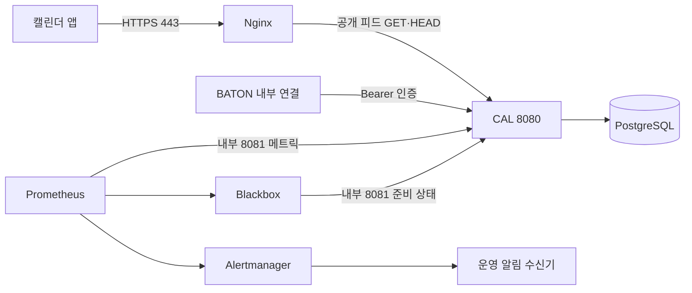

# cal.b4ton.com 운영 구성과 배포 준비

## 현재 범위

`cal.b4ton.com`을 CAL 공개 호스트로 사용한다. `b4ton.com`의 BATON 본체와 배포·요청 제한을
분리하며 공개 기본 주소는 `https://cal.b4ton.com`이다. 기존 iCalendar UID의 `@cal.baton`과
JSON Schema `$id`는 식별자이므로 도메인에 맞춰 바꾸지 않는다.

[compose.operations.yml](../compose.operations.yml)은 단일 Docker 호스트용 구성이다.
Nginx HTTPS·요청 제한, CAL, PostgreSQL, Prometheus, Alertmanager와 준비 상태 점검용
Blackbox Exporter를 포함한다. 2026-09-05 현재 실제 서버·DNS·공인 인증서·운영 알림 수신기는
미구축 상태다. 로컬 스모크는 자체 서명 인증서를 명시적으로 신뢰해 실행하며 공인 인증서 발급이나
Google·Outlook의 외부 수집을 증명하지 않는다.

## 연결과 공개 범위



- Nginx는 `/calendars/v1/`만 CAL로 전달하며 GET·HEAD 이외 요청은 `405`다.
  내부 API·Actuator·그 밖의 경로는 `404`로 닫는다. 공개 피드의 ETag·Last-Modified·304는 보존한다.
- HTTP 80은 ACME 갱신 파일과 고정 HTTPS 호스트로의 `308` 이동만 제공한다.
  발급되는 구독 URL은 항상 HTTPS다.
- 기본 바인드는 모두 `127.0.0.1`이다. 운영 호스트에서 외부 공개 준비를 마친 뒤
  `CAL_GATEWAY_BIND=0.0.0.0`으로 게이트웨이 80·443만 공개한다.
- CAL 내부 포트 8080과 Prometheus 9090·Alertmanager 9093은 호스트 루프백에만 바인드한다.
  관리 8081, PostgreSQL과 Blackbox는 호스트에 게시하지 않는다. 다른 서버의 BATON은 VPN·사설
  연결로 접근하게 구성하며 이 파일에서 내부 포트를 공인 주소에 바인드하지 않는다.
- Prometheus는 내부 메트릭과 준비 상태를 검사한다. 이 서버 전체나 공인 DNS·인증서 장애를
  스스로 통보하지 못할 수 있으므로 운영에서는 다른 호스트의 외부 가용성 점검도 필요하다.

## 필요한 외부 설정

Compose 파일과 저장소에 운영 비밀을 쓰지 않는다. 실행 관리자가 아래 값을 외부 런타임 환경에
주입해야 한다. `docker compose config`는 비밀이 포함된 전체 환경을 출력할 수 있으므로 검증에는
`config --quiet`를 사용한다.

| 설정 | 의미 |
| --- | --- |
| `BATON_CAL_IMAGE` | 검증된 전체 커밋 SHA 태그 또는 다이제스트로 고정한 CAL OCI 이미지 |
| `DATABASE_USERNAME`, `DATABASE_PASSWORD` | CAL 전용 DB 계정. 다른 서비스 계정과 공유하지 않음 |
| `BATON_CAL_INTERNAL_TOKEN` | BATON→CAL 전용 32자 이상 Bearer 값 |
| `BATON_CAL_PREVIOUS_INTERNAL_TOKEN` | 회전 기간에만 외부에서 주입하는 이전 Bearer 값. 완료하면 환경에서 제거 |
| `BATON_CAL_SUBSCRIPTION_GENERATION` | 최초 설치 때 생성한 UUID. 모든 자릿수가 0인 값은 금지하며 일반 배포마다 바꾸지 않음 |
| `BATON_CAL_RECOVERY_MODE` | 정상 `false`, 과거 백업 복원 중 `true` |
| `CAL_TLS_DIRECTORY` | 외부 인증서 디렉터리. 기본 Certbot 구조이면 `/etc/letsencrypt` |
| `CAL_ACME_DIRECTORY` | HTTP 인증서 갱신 파일 디렉터리. 예: `/srv/baton-cal/acme` |
| `CAL_ALERT_WEBHOOK_URL_FILE` | Alertmanager 표준 webhook 수신 URL을 담은 외부 파일의 절대 경로 |
| `CAL_GATEWAY_BIND` | 로컬 점검은 기본 `127.0.0.1`, 외부 공개는 `0.0.0.0` |

선택적인 포트는 `CAL_INTERNAL_PORT`, `CAL_HTTP_PORT`, `CAL_HTTPS_PORT`, `CAL_PROMETHEUS_PORT`,
`CAL_ALERTMANAGER_PORT`로 조정한다. 포트 `0`은 스모크에서만 사용해 충돌 없는 동적 포트를 할당한다.

Alertmanager는 표준 JSON webhook을 보낸다. Slack 등의 전용 incoming webhook URL을 이 파일에
그대로 넣으면 형식이 다를 수 있으므로 수신 서비스가 정해진 뒤 해당 서비스 전용 수신 설정으로
연결한다. 알림 URL 파일은 Alertmanager 사용자에게 읽기 권한만 부여하고 저장소 밖에서 관리한다.
[Alertmanager webhook 형식](https://prometheus.io/docs/alerting/latest/configuration/#webhook_config).

## 최초 HTTPS 연결 순서

아래는 **아직 실행하지 않은 운영 절차**다. 서버 주소와 DNS 제공자를 정한 뒤 실행한다.
운영 비밀·서버 경로·이미지는 실제 환경에서 준비하며 예시를 임의 자격 증명으로 대체하지 않는다.

1. 배포 서버에 Docker Compose와 Certbot을 준비한다. DNS에 `cal` A 레코드를 서버의 공인 IPv4로
   연결한다. 실제 IPv6가 준비된 경우에만 AAAA도 추가한다. 최초 구성은 CDN 없이 Nginx가 직접
   클라이언트 연결을 받는 형태다.
2. 외부 80·443 접근을 허용하고 DNS가 이 서버를 가리키는지 확인한다. Nginx를 처음 실행하기 전
   Certbot standalone 방식으로 `cal.b4ton.com` 인증서를 발급한다. 이미 80을 쓰는 서비스가 있는
   서버라면 그 서버의 기존 인증서 관리 방식으로 통합하고 실행 중인 서비스를 임의 중단하지 않는다.

```shell
sudo certbot certonly --standalone --domain cal.b4ton.com
```

3. 생성된 `/etc/letsencrypt` 전체를 읽기 전용으로 연결한다. `live`의 심볼릭 링크가 `archive`를
   참조하므로 PEM 파일 하나만 마운트하지 않는다. TLS 개인키는 Nginx 주 프로세스만 읽도록 관리한다.
   Nginx는 `live/cal.b4ton.com/fullchain.pem`과 `privkey.pem`을 사용한다.
   [Nginx HTTPS·인증서 체인 안내](https://nginx.org/en/docs/http/configuring_https_servers.html).
4. 위 외부 환경을 주입하고 `CAL_GATEWAY_BIND=0.0.0.0`을 설정한 배포 세션에서 검증·기동한다.
   고정 project 이름 `baton-cal`을 재배포에서도 유지해 DB 볼륨을 바꾸지 않는다.

```shell
docker compose --project-name baton-cal --file compose.operations.yml config --quiet
docker compose --project-name baton-cal --file compose.operations.yml up --detach
docker compose --project-name baton-cal --file compose.operations.yml exec -T gateway nginx -t
```

5. Nginx가 제공하는 ACME 디렉터리로 향후 갱신을 전환한다. Certbot 2.3 이상에서 아래 명령은
   staging 갱신 검증 후 갱신 설정을 저장한다. OS의 Certbot 갱신 타이머도 활성 상태인지 확인한다.
   [Certbot 갱신 설정 변경](https://eff-certbot.readthedocs.io/en/stable/using.html#modifying-the-renewal-configuration-of-existing-certificates).

```shell
sudo certbot reconfigure --cert-name cal.b4ton.com \
  --authenticator webroot --webroot-path /srv/baton-cal/acme
sudo certbot renew --dry-run
```

6. 인증서 갱신 성공 후 배포 관리자가 다음 Nginx 검증·reload 명령을 실행하도록 deploy hook에
   연결한다. 갱신 서비스가 저장소 위치와 외부 환경을 알도록 실제 서버 경로에서 구성한다.
   갱신 dry-run과 hook 동작까지 운영 환경에서 확인하기 전에는 자동 갱신 완료로 기록하지 않는다.

```shell
docker compose --project-name baton-cal --file compose.operations.yml exec -T gateway nginx -t
docker compose --project-name baton-cal --file compose.operations.yml exec -T gateway nginx -s reload
```

7. 외부에서 인증서 호스트·체인, `/actuator/prometheus`와 `/internal/api/v1/subscriptions`의 `404`,
   테스트 구독의 `200`·`304`를 확인한다. [앱별 구독 확인](calendar-subscription-guide.md)을 진행한다.

공인 인증서·DNS·방화벽 검증은 로컬 스모크와 별도다. 기존 데이터 마이그레이션, 내부 Bearer 회전과
과거 백업 복원은 [README](../README.md)의 구버전 종료·구독 세대·복구 완료 절차를 그대로 적용한다.
운영 DB 볼륨에는 스모크의 `down --volumes` 정리 명령을 사용하지 않는다.

## 요청 제한과 로그

Nginx 표준 `limit_req`·`limit_conn`을 사용한다. IP별 기본 요청률은 `10r/s`, 순간 초과 허용은
20개, 동시 처리 제한은 20개다. 설정은 `CAL_REQUEST_RATE`, `CAL_REQUEST_BURST`,
`CAL_CONNECTION_LIMIT`로 바꾸고 게이트웨이를 다시 생성한다. 요청 수 또는 동시 처리 제한을
넘으면 `429`, `Retry-After: 1`, `Cache-Control: no-store`를 반환한다. 이 응답은 프록시 HTML이며
CAL 내부 API의 JSON 오류 계약과 구분한다.

Google·Microsoft가 송신 IP를 공유하면 같은 IP의 정상 구독도 함께 제한된다. 이 기본값은 운영
규모나 SLO가 아니며, 실제 갱신 빈도·429 비율과 DB 부하를 보고 조정한다. 앞단에 CDN·다른 프록시를
추가하면 실제 송신 IP와 신뢰 프록시 대역을 먼저 구성해야 한다. 사용자 입력 `X-Forwarded-For`를
그대로 신뢰하지 않는다.
[Nginx 요청률 제한](https://nginx.org/en/docs/http/ngx_http_limit_req_module.html),
[Nginx 동시 처리 제한](https://nginx.org/en/docs/http/ngx_http_limit_conn_module.html).

접근 로그에는 상태 코드, 처리 시간, 제한 결과만 기록한다. 요청 경로·쿼리·Cookie·Authorization은
기록하지 않는다. 요청 오류 메시지에 원문 URL이 들어갈 수 있어 Nginx error log는 비활성화한다.
시작 설정 오류는 `nginx -t`로 점검하고 요청 장애는 안전한 접근 로그·CAL 메트릭으로 좁힌다.
프록시는 조건부 GET 헤더와 고정 Host만 CAL에 전달하고 쿼리와 원문 요청 헤더를 버린다.

## 모니터링과 알림

Prometheus는 10초마다 수집·평가하며 로컬 저장 기간은 15일이다. Alertmanager는 발생·해제를
전달하고 같은 알림은 기본 4시간 후 반복한다. 첫 연결 시 실제 수신 채널에서도 장애·해제 한 쌍을
확인해야 한다. 아래 값은 초기 운영 설정이며 트래픽 관측 뒤 조정한다.

| 알림 | 조건 | 최초 확인할 내용 |
| --- | --- | --- |
| `CalMetricsUnavailable` | 메트릭 수집 실패가 30초 지속 | CAL 프로세스·8081 내부 연결 |
| `CalReadinessFailed` | 준비 상태 실패 또는 점검기 수집 실패가 30초 지속 | CAL·PostgreSQL·Blackbox |
| `CalHttpServerErrors` | 최근 5분의 CAL 5xx가 5회 이상인 상태가 1분 지속 | DB·일시적 503·잠금 지연 |
| `CalProjectionLockSlow` | 최근 5분 평균 잠금 획득 시간이 1초 초과한 상태가 2분 지속 | 같은 시즌 동시 수신과 전체 재구축 비용 |

알림의 `for`는 조건이 계속 유지돼야 하는 시간이며 실제 도착에는 수집·평가와 Alertmanager의
그룹 대기 시간이 추가된다. [Prometheus 알림 규칙](https://prometheus.io/docs/prometheus/latest/configuration/alerting_rules/).
5xx 지표는 CAL에서 처리한 응답만 포함하므로 Nginx에서 발생한 502·429는 안전한 접근 로그에서 확인한다.
운영에서는 호스트·인증서 만료·Prometheus 자체 장애를 외부에서 점검하는 경로도 연결한다.

## 재현 가능한 로컬 검증

```shell
./gradlew --no-daemon bootBuildImage --imageName=baton-cal:smoke
./scripts/smoke-operations.sh baton-cal:smoke
```

격리 project·빈 DB·가짜 자격 증명·임시 인증서로 실행하고 종료 시 해당 자원만 정리한다. 실제 DNS를
바꾸지 않고 TLS 호스트를 로컬로 연결한다. 다음을 검증한다.

- Compose·Prometheus 규칙·Alertmanager·Nginx 설정 구문.
- HTTPS 이름 검증, 피드 200·304, 내부·관리 경로 404, 허용하지 않는 메서드 405.
- ACME 파일, HTTP→HTTPS 이동, 실제 요청 초과 429와 재시도 헤더.
- CAL 중단→준비 상태 장애→로컬 webhook의 `firing`, 재시작→`resolved` 전달.
- 정상·제한·upstream 실패 경로의 컨테이너 로그, 원본 메트릭과 Prometheus 저장 라벨에
  구독 토큰·내부 Bearer·쿼리 표식이 없는지 확인.

스모크 수신기는 테스트 전용이며 운영 Compose에는 포함되지 않는다. 메트릭 규칙의 구문은 전부
검증하고 실제 장애 주입은 준비 상태 실패를 사용한다. 모든 임계값을 부하로 재현한 시험이나
운영 수신 채널·네트워크 검증으로 확대해 기록하지 않는다.
