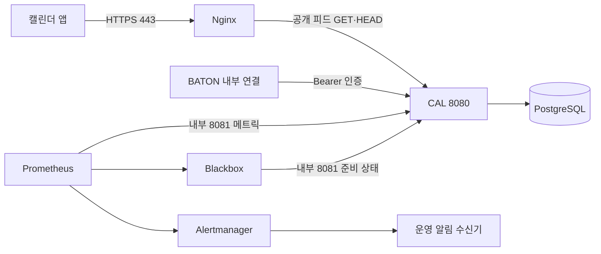

# cal.b4ton.com 운영 연동과 검증

## 현재 범위

`cal.b4ton.com`을 CAL 공개 호스트로 사용한다. `b4ton.com`의 BATON 본체와 배포·요청 제한을
분리하며 공개 기본 주소는 `https://cal.b4ton.com`이다. 기존 iCalendar UID의 `@cal.baton`과
JSON Schema `$id`는 식별자이므로 도메인에 맞춰 바꾸지 않는다.

[compose.operations.yml](../compose.operations.yml)은 단일 Docker 호스트용 구성이다.
Nginx HTTPS·요청 제한, CAL, PostgreSQL, Prometheus, Alertmanager와 준비 상태 점검용
Blackbox Exporter를 포함한다. 이 구성은 로컬 통합 검증에도 사용한다. 사용자 확인 기준으로 홈서버는
Ubuntu이며 DNS·공인 IP·80/443 포트포워딩·인증서가 준비됐고, 실제 운영은 아직 구축 전인 k3s를 사용할
예정이다. 여기서 홈서버 설치·k3s 배포는 수행하지 않는다. 로컬 스모크는 자체 서명 인증서를 신뢰하도록
설정해 실행한다. 실제 운영 연결과 Google·Outlook의 구독 조회는 별도로 확인해야 한다.

## 연결과 공개 범위



- Nginx는 `/calendars/v1/`만 CAL로 전달하며 GET·HEAD 이외 요청은 `405`다.
  내부 API·Actuator·그 밖의 경로에는 `404`를 반환한다. 공개 피드의 ETag·Last-Modified·304는 유지한다.
- HTTP 80은 ACME 갱신 파일과 고정 HTTPS 호스트로의 `308` 이동만 제공한다.
  발급되는 구독 URL은 항상 HTTPS다.
- 기본 바인드는 모두 `127.0.0.1`이다. 운영 호스트에서 외부 공개 준비를 마친 뒤
  `CAL_GATEWAY_BIND=0.0.0.0`으로 게이트웨이 80·443만 공개한다.
- CAL 내부 포트 8080과 Prometheus 9090·Alertmanager 9093은 호스트 루프백에만 바인드한다.
  관리 8081, PostgreSQL과 Blackbox의 포트는 호스트에 열지 않는다. 다른 서버의 BATON은 VPN·사설
  연결로 접근하게 구성하며 이 파일에서 내부 포트를 공인 주소에 바인드하지 않는다.
- Prometheus는 내부 메트릭과 준비 상태를 검사한다. 이 서버 전체나 공인 DNS·인증서 장애를
  스스로 통보하지 못할 수 있으므로 운영에서는 다른 호스트의 외부 가용성 점검도 필요하다.

## 필요한 외부 설정

Compose 파일과 저장소에 운영 비밀번호·토큰을 쓰지 않는다. 배포 담당자가 아래 값을 실행 환경에
설정해야 한다. `docker compose config`는 비밀값이 포함된 전체 환경을 출력할 수 있으므로 검증에는
`config --quiet`를 사용한다.

| 설정 | 의미 |
| --- | --- |
| `BATON_CAL_IMAGE` | 검증된 전체 커밋 SHA 태그 또는 다이제스트로 고정한 CAL OCI 이미지 |
| `DATABASE_USERNAME`, `DATABASE_PASSWORD` | CAL 전용 DB 계정. 다른 서비스 계정과 공유하지 않음 |
| `BATON_CAL_INTERNAL_TOKEN` | BATON→CAL 전용 32자 이상 Bearer 값 |
| `BATON_CAL_PREVIOUS_INTERNAL_TOKEN` | 토큰 교체 기간에만 설정하는 이전 Bearer 값. 교체 후 환경에서 제거 |
| `BATON_CAL_SUBSCRIPTION_GENERATION` | 최초 설치 때 생성한 UUID. 모든 자릿수가 0인 값은 금지하며 일반 배포마다 바꾸지 않음 |
| `BATON_CAL_RECOVERY_MODE` | 정상 `false`, 과거 백업 복원 중 `true` |
| `CAL_TLS_DIRECTORY` | 외부 인증서 디렉터리. 기본 Certbot 구조이면 `/etc/letsencrypt` |
| `CAL_ACME_DIRECTORY` | HTTP 인증서 갱신 파일 디렉터리. 예: `/srv/baton-cal/acme` |
| `CAL_ALERT_WEBHOOK_URL_FILE` | 선택한 채널의 웹훅 URL을 담은 외부 파일의 절대 경로 |
| `CAL_ALERTMANAGER_CONFIG_FILE` | 알림 수신 설정 파일. 생략하면 기존 일반 웹훅 설정 |
| `CAL_GATEWAY_BIND` | 로컬 점검은 기본 `127.0.0.1`, 외부 공개는 `0.0.0.0` |

선택적인 포트는 `CAL_INTERNAL_PORT`, `CAL_HTTP_PORT`, `CAL_HTTPS_PORT`, `CAL_PROMETHEUS_PORT`,
`CAL_ALERTMANAGER_PORT`로 조정한다. 포트 `0`은 스모크에서만 사용해 충돌 없는 동적 포트를 할당한다.

알림 URL 파일은 Alertmanager 사용자가 읽을 수 있게 하고 저장소 밖에서 관리한다. 채널에 맞는
아래 수신 설정을 선택한다. 일반 웹훅 설정에 Slack·Discord URL만 넣으면 메시지 형식이 맞지 않는다.

## 운영 알림 채널 연결

| 수신 채널 | `CAL_ALERTMANAGER_CONFIG_FILE` | URL 파일 내용 |
| --- | --- | --- |
| 기존 일반 웹훅 수신기 | 생략 | Alertmanager 표준 JSON을 받는 URL |
| Slack | `./operations/alertmanager/slack.yml` | 채널의 Incoming Webhook URL |
| Discord | `./operations/alertmanager/discord.yml` | 채널의 Webhook URL |

`CAL_ALERT_WEBHOOK_URL_FILE`에는 위 URL을 담은 파일의 절대 경로를 지정한다. 실제 URL을 Compose·Git·
명령 인수에 직접 넣지 않는다. 두 채널 모두 장애 발생과 복구를 알리며, 전송 형식과 재시도는
Alertmanager가 처리한다. 새 유료 서비스나 알림 중계 서버가 필요하지 않다.

예를 들어 Slack을 선택하면 기존 운영 환경에서 `CAL_ALERTMANAGER_CONFIG_FILE`만 Slack 설정 경로로
바꾸고 기존 URL 파일에 채널 웹훅 URL을 제공한다. 수신 채널의 실제 동작 확인은 별도로 진행한다.

k3s에서도 같은 YAML을 Alertmanager 설정으로 사용하고, 수신 URL은 Secret 파일을
`/run/secrets/alert-webhook-url`에 마운트하면 된다. 이는 연동에 필요한 값이며 k3s 설치 절차는 아니다.
[Alertmanager 기본 연동](https://prometheus.io/docs/alerting/latest/configuration/).

## 서버와 모니터링 중단 감지

홈서버가 꺼지면 같은 서버의 Alertmanager도 알림을 보내지 못한다. 이를 확인하려면 외부 서비스가
주기적인 정상 신호를 받고, 신호가 끊겼을 때 알리게 한다. 선택 구성은 Healthchecks.io의 무료
Hobbyist 점검 1개를 사용한다. 기준일은 2026-09-12이며 무료 한도는 점검 20개·점검당 기록 100개다.
[요금 기준](https://healthchecks.io/pricing/)

1. Healthchecks.io에서 `CAL 모니터링` 점검을 만들고 Simple 주기를 2분, Grace Time을 3분으로 지정한다.
   이메일 등 무료 수신 채널을 연결한다. 유료 플랜·문자·전화 알림은 선택하지 않는다.
2. 해당 점검의 HTTPS 성공 URL을 외부 파일에 보관한다. `/start`·`/fail`·`/log` 접미사를 붙이지 않고,
   요청 본문 필터는 끈다. 수신 메서드를 제한한다면 POST를 허용한다.
3. Alertmanager에 [Healthchecks 수신 설정](../operations/alertmanager/healthchecks.yml)을 적용하고 URL 파일을
   `/run/secrets/healthchecks-ping-url`에 읽기 전용으로 연결한다. k3s에서는 같은 경로에 Secret 파일을 제공한다.
4. Healthchecks.io의 최근 수신을 확인한 뒤 점검 경로를 잠시 중단해 신호 누락 알림과 재개 후 복구를 확인한다.

기존 Compose에 연결할 때는 `compose.healthchecks.yml`을 추가하고 `CAL_HEALTHCHECKS_PING_URL_FILE`에
URL 파일의 절대 경로를 지정한다. 기본 선택은 일반 웹훅과 Healthchecks를 함께 쓰는 설정이다.
`CAL_ALERTMANAGER_CONFIG_FILE`을 지정하면 해당 파일을 사용한다.

Slack·Discord와 함께 쓰려면 해당 채널 설정의 `CalWatchdog` 경로를 Healthchecks 설정의 같은 경로로
교체하고 `healthchecks` 수신기를 추가한다. 채널의 `operations` 수신기는 유지하며, 합친 파일 경로를
`CAL_ALERTMANAGER_CONFIG_FILE`에 지정한다. 일반 웹훅 수신기에 Slack·Discord URL을 넣지 않는다.

`CalWatchdog`는 장애 유무와 관계없이 유지하는 정상 신호다. 기본 일반 웹훅·Slack·Discord 설정은
이를 버리며, Healthchecks를 선택하면 1분을 반복 전송 기준으로 삼고 10초마다 전송 여부를 확인한다.
전송 시점은 처리 시간에 따라 늦어질 수 있다. 전송 본문은 고정된 서비스 이름과 `alive`만
포함한다. 내부 주소·메트릭·일정·구독 토큰을 보내지 않으며 신호가 해제됐을 때는 전송하지 않는다.

신호가 한 번 수신된 뒤에는 마지막 수신부터 5분이 지나면 외부 점검이 누락으로 판정한다. 첫 신호를
받기 전에는 점검이 시작되지 않는다. Prometheus만 멈춘 경우에는 Alertmanager가 마지막 알림을 유효하게
보는 시간이 추가될 수 있다. 신호 중단은 서버·송신 경로 문제를 뜻하며 CAL·DB·공인 DNS·인입 HTTPS의
정상 여부는 기존 상태 점검과 별도 외부 HTTP 점검으로 확인한다. 계정 등록·실제 알림 전송은 아직 수행하지 않았다.
[신호 API](https://healthchecks.io/docs/http_api/), [주기와 유예 시간](https://healthchecks.io/docs/configuring_checks/)

## 최초 HTTPS 연결 순서

아래는 기존 **Docker Compose 배포 참고 절차**다. 이미 준비된 인증서를 다시 발급하는 작업은 아니다.
운영 비밀번호·토큰·서버 경로·이미지는 실제 배포에 사용할 값으로 준비한다.

1. 배포 서버에 Docker Compose와 Certbot을 준비한다. DNS에 `cal` A 레코드를 서버의 공인 IPv4로
   연결한다. 실제 IPv6가 준비된 경우에만 AAAA도 추가한다. 최초 구성은 CDN 없이 Nginx가 직접
   클라이언트 연결을 받는 형태다.
2. 외부 80·443 접근을 허용하고 DNS가 이 서버를 가리키는지 확인한다. Nginx를 처음 실행하기 전
   Certbot standalone 방식으로 `cal.b4ton.com` 인증서를 발급한다. 이미 80을 쓰는 서비스가 있는
   서버라면 그 서버의 기존 인증서 관리 방식으로 통합하고 실행 중인 서비스를 임의 중단하지 않는다.

```shell
sudo certbot certonly --standalone --domain cal.b4ton.com
```

3. 생성된 `/etc/letsencrypt` 전체를 읽기 전용으로 연결한다. `live`의 심볼릭 링크가 `archive`를
   참조하므로 PEM 파일 하나만 마운트하지 않는다. TLS 개인키는 Nginx 주 프로세스만 읽도록 관리한다.
   Nginx는 `live/cal.b4ton.com/fullchain.pem`과 `privkey.pem`을 사용한다.
   [Nginx HTTPS·인증서 체인 안내](https://nginx.org/en/docs/http/configuring_https_servers.html).
4. 위 외부 환경을 주입하고 `CAL_GATEWAY_BIND=0.0.0.0`을 설정한 배포 세션에서 검증·기동한다.
   재배포할 때도 Compose 프로젝트 이름 `baton-cal`을 유지해 같은 DB 볼륨을 사용한다.

```shell
docker compose --project-name baton-cal --file compose.operations.yml config --quiet
docker compose --project-name baton-cal --file compose.operations.yml up --detach
docker compose --project-name baton-cal --file compose.operations.yml exec -T gateway nginx -t
```

5. Nginx가 제공하는 ACME 디렉터리로 향후 갱신을 전환한다. Certbot 2.3 이상에서 아래 명령은
   staging 갱신 검증 후 갱신 설정을 저장한다. OS의 Certbot 갱신 타이머도 활성 상태인지 확인한다.
   [Certbot 갱신 설정 변경](https://eff-certbot.readthedocs.io/en/stable/using.html#modifying-the-renewal-configuration-of-existing-certificates).

```shell
sudo certbot reconfigure --cert-name cal.b4ton.com \
  --authenticator webroot --webroot-path /srv/baton-cal/acme
sudo certbot renew --dry-run
```

6. 인증서 갱신 성공 후 배포 관리자가 다음 Nginx 검증·reload 명령을 실행하도록 deploy hook에
   연결한다. 갱신 서비스가 저장소 위치와 외부 환경을 알도록 실제 서버 경로에서 구성한다.
   갱신 dry-run과 hook 동작까지 운영 환경에서 확인하기 전에는 자동 갱신 완료로 기록하지 않는다.

```shell
docker compose --project-name baton-cal --file compose.operations.yml exec -T gateway nginx -t
docker compose --project-name baton-cal --file compose.operations.yml exec -T gateway nginx -s reload
```

7. 외부에서 인증서 호스트·체인, `/actuator/prometheus`와 `/internal/api/v1/subscriptions`의 `404`,
   테스트 구독의 `200`·`304`를 확인한다. [앱별 구독 확인](calendar-subscription-guide.md)을 진행한다.

공인 인증서·DNS·방화벽 검증은 로컬 스모크와 별도다. 기존 데이터 마이그레이션, 내부 Bearer 회전과
과거 백업 복원은 [README](../README.md)의 구버전 종료·구독 세대·복구 완료 절차를 그대로 적용한다.
운영 DB 볼륨에는 스모크의 `down --volumes` 정리 명령을 사용하지 않는다.

## 요청 제한과 로그

Nginx 표준 `limit_req`·`limit_conn`을 사용한다. IP별 기본 요청률은 `10r/s`, 순간 초과 허용은
20개, 동시 처리 제한은 20개다. 설정은 `CAL_REQUEST_RATE`, `CAL_REQUEST_BURST`,
`CAL_CONNECTION_LIMIT`로 바꾸고 게이트웨이를 다시 생성한다. 요청 수 또는 동시 처리 제한을
넘으면 `429`, `Retry-After: 1`, `Cache-Control: no-store`를 반환한다. 이 응답은 프록시 HTML이며
CAL 내부 API의 JSON 오류 계약과 구분한다.

Google·Microsoft가 송신 IP를 공유하면 같은 IP의 정상 구독도 함께 제한된다. 이 기본값은 운영
처리량이나 서비스 수준 목표(SLO)를 보장하지 않으며, 실제 갱신 빈도·429 비율과 DB 부하를 보고 조정한다. 앞단에 CDN·다른 프록시를
추가하면 실제 송신 IP와 신뢰 프록시 대역을 먼저 구성해야 한다. 사용자 입력 `X-Forwarded-For`를
그대로 신뢰하지 않는다.
[Nginx 요청률 제한](https://nginx.org/en/docs/http/ngx_http_limit_req_module.html),
[Nginx 동시 처리 제한](https://nginx.org/en/docs/http/ngx_http_limit_conn_module.html).

접근 로그에는 상태 코드, 처리 시간, 제한 결과만 기록한다. 요청 경로·쿼리·Cookie·Authorization은
기록하지 않는다. 요청 오류 메시지에 원문 URL이 들어갈 수 있어 Nginx error log는 비활성화한다.
시작 설정 오류는 `nginx -t`로 점검하고 요청 장애 원인은 접근 로그·CAL 메트릭으로 확인한다.
프록시는 조건부 GET 헤더와 고정 Host만 CAL에 전달하고 쿼리와 원문 요청 헤더를 버린다.

## 모니터링과 알림

Prometheus는 10초마다 수집·평가하며 로컬 저장 기간은 15일이다. Alertmanager는 발생·해제를
전달하고 같은 알림은 기본 4시간 후 반복한다. 첫 연결 시 실제 수신 채널에 장애 발생·해제 알림이
모두 도착하는지 확인한다. 아래 값은 초기 설정이며 실제 트래픽을 확인한 뒤 조정한다.

| 알림 | 조건 | 최초 확인할 내용 |
| --- | --- | --- |
| `CalWatchdog` | 항상 활성화. Healthchecks 선택 시 1분 기준으로 정상 신호 반복 전송 | 신호 누락은 외부 서비스가 판정. 기본 채널에는 전송하지 않음 |
| `CalMetricsUnavailable` | 메트릭 수집 실패가 30초 지속 | CAL 프로세스·8081 내부 연결 |
| `CalReadinessFailed` | 준비 상태 실패 또는 점검기 수집 실패가 30초 지속 | CAL·PostgreSQL·Blackbox |
| `CalHttpServerErrors` | 최근 5분의 CAL 5xx가 5회 이상인 상태가 1분 지속 | DB·일시적 503·잠금 지연 |
| `CalProjectionLockSlow` | 최근 5분 평균 잠금 획득 시간이 1초 초과한 상태가 2분 지속 | 같은 시즌의 동시 수신량과 전체 재구축 소요 시간 |
| `CalTlsFailed` | TLS 점검 또는 점검기 수집 실패가 5분 지속 | 인증서 이름·체인·HTTPS 포트 연결 |
| `CalCertificateExpiresSoon` | 인증서의 남은 기간이 14일 미만인 상태가 10분 지속 | 기존 인증서 관리 도구의 갱신·적용 상태 |

TLS 점검은 1분마다 `gateway:443`에 연결해 `cal.b4ton.com`의 이름과 인증서 체인을 확인한다.
구독 주소나 토큰은 사용하지 않는다. k3s에서 TLS를 Traefik이 처리하면 이 대상만 실제 TLS 서비스
주소로 바꾼다. 예: `traefik.kube-system.svc.cluster.local:443`. 같은 홈서버 안의 검사는 공인 DNS·
공유기·인터넷 회선 장애를 확인하는 외부 점검과 구분한다.

알림의 `for`는 조건이 계속 유지돼야 하는 시간이며 실제 도착에는 수집·평가와 Alertmanager의
그룹 대기 시간이 추가된다. [Prometheus 알림 규칙](https://prometheus.io/docs/prometheus/latest/configuration/alerting_rules/).
5xx 지표는 CAL에서 처리한 응답만 포함하므로 Nginx에서 발생한 502·429는 Nginx 접근 로그에서 확인한다.
운영에서는 호스트·인증서 만료·Prometheus 자체 장애를 외부에서 점검하는 경로도 연결한다.

## 재현 가능한 로컬 검증

```shell
./gradlew --no-daemon bootBuildImage --imageName=baton-cal:smoke
./scripts/smoke-operations.sh baton-cal:smoke
bash scripts/smoke-alert-channels.sh
```

별도 Compose 프로젝트·빈 DB·테스트용 인증 정보·임시 인증서로 실행하고 종료 시 해당 자원만 정리한다. 실제 DNS를
바꾸지 않고 TLS 호스트를 로컬로 연결한다. 다음을 검증한다.

- Compose·Prometheus 규칙·Alertmanager·Nginx 설정 구문.
- HTTPS 이름 검증, 피드 200·304, 내부·관리 경로 404, 허용하지 않는 메서드 405.
- ACME 파일, HTTP→HTTPS 이동, 실제 요청 초과 429와 재시도 헤더.
- Blackbox의 TLS 인증서 확인·만료 시각 수집, 연결 실패 탐지와 인증서 알림 규칙.
- CAL 중단 후 프록시의 `502` 또는 `504`, 준비 상태 장애→로컬 webhook의 `firing`, 재시작→`resolved` 전달.
- Healthchecks 모의 API에 정상 신호 반복 전송, 원본 갱신 중단·신호 해제 후 전송 중단, 재개 후 다시 전송.
- 정상·제한·upstream 실패 경로의 컨테이너 로그, 원본 메트릭과 Prometheus 저장 라벨에
  구독 토큰·내부 Bearer·쿼리 표식이 없는지 확인.

스모크 수신기는 테스트 전용이며 운영 Compose에는 포함되지 않는다. 메트릭 규칙의 구문은 전부
검증하고 실제 장애 주입은 준비 상태 실패를 사용한다. 모든 임계값을 부하로 재현한 시험이나
운영 수신 채널·네트워크 검증으로 확대해 기록하지 않는다.

알림 채널 스모크는 외부 통신을 차단한 Docker 네트워크에서 실제 Alertmanager와 모의 Slack·Discord
API를 사용한다. 채널별 메시지 형식·발생·해제·웹훅 주소 비노출을 확인하며 실제 채널로 보내지 않는다.
운영 스모크는 Healthchecks 연결 설정과 모의 API도 사용한다. 외부 서비스의 누락 판정·실제 알림 도착은
계정 연결 후 확인해야 하며, 로컬 검증 결과에 포함하지 않는다.
